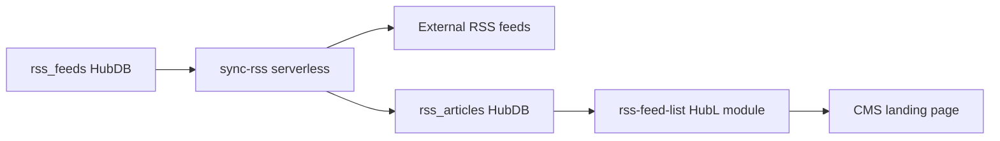

# Lab 10 — HubSpot RSS Aggregator (Skill + MCP)

Repository: https://github.com/lilarock3rs/Lab10-HubSpot-RSS-Aggregator

RSS → HubDB → HubL CMS module, orchestrated by the `hubspot-rss-hubdb-aggregator` skill and **HubSpotDev** MCP.

## How it works



1. **rss_feeds** stores RSS source URLs (`enabled = true` to sync).
2. **sync-rss** (CMS serverless) fetches feeds, parses XML, and writes rows to **rss_articles** (dedupe by `guid`).
3. **rss-feed-list** reads published HubDB rows via `hubdb_table_rows()` and renders them on a page.

Sync is **manual** by default (POST to the serverless endpoint). Use a **HubSpot scheduled workflow** webhook to the same URL for automatic sync.

## MVP decisions

- Module: **HubL**
- Scope: **2 demo feeds**, **manual** sync (POST to serverless)
- HubDB: **`hs hubdb create`** (no MCP tool for tables)
- Design Manager serverless URL: **`/_hcms/api/sync-rss`** (not `/hs/serverless/`)

## Prerequisites

1. `npm install -g @hubspot/cli` and `hs auth`
2. HubSpotDev MCP in Cursor (`hs mcp setup --client cursor`)
3. HubSpot portal with **CMS + HubDB** (this repo uses account `integrations-mvp`)

## Project structure

```
.cursor/skills/hubspot-rss-hubdb-aggregator/
hubdb/rss_feeds.json          # CLI: create table + 2 demo feed rows
hubdb/rss_articles.json       # CLI: create empty articles table
cms/sync-rss.functions/
cms/rss-feed-list.module/
scripts/create-hubdb-tables.sh
```

## Setup

### 1. Create HubDB tables (CLI)

```bash
cd /path/to/Lab10-HubSpot-RSS-Aggregator
./scripts/create-hubdb-tables.sh
```

Tables in portal `47232509`:

| Name | Table ID |
|------|----------|
| rss_feeds | 294548351 |
| rss_articles | 294681971 |

**Publish** in [HubDB](https://app.hubspot.com/hubdb/47232509): open each table → **Publish**.

### 2. Serverless secret

Create a Private App with the **`hubdb`** scope, then:

```bash
hs secrets add HUBSPOT_PRIVATE_APP_TOKEN
```

### 3. Upload CMS assets

Design Manager path: `rss-aggregator/`

```bash
hs cms upload cms/rss-feed-list.module rss-aggregator/modules/rss-feed-list.module
hs cms upload cms/sync-rss.functions rss-aggregator/sync-rss.functions
```

### 4. Sync RSS

CMS domain for this portal:

`https://integrations-47232509.hubspotpagebuilder.com`

Design Manager serverless uses `/_hcms/api/`:

```bash
curl -X POST "https://integrations-47232509.hubspotpagebuilder.com/_hcms/api/sync-rss?portalid=47232509" \
  -H "Content-Type: application/json"
```

Example response:

```json
{"ok":true,"feedsProcessed":2,"created":30,"skipped":0}
```

Re-run sync anytime. Existing articles are skipped by `guid` (`skipped` count increases).

**Publish** `rss_articles` again if rows were written to draft.

### 5. Scheduled sync (optional — HubSpot workflow)

After deploy, the skill outputs a block like:

```
POST https://integrations-47232509.hubspotpagebuilder.com/_hcms/api/sync-rss?portalid=47232509
Content-Type: application/json
```

Create a **Scheduled workflow** in HubSpot → add **Send webhook** (POST to that URL) → set daily/weekly timer.  
Details: `.cursor/skills/hubspot-rss-hubdb-aggregator/reference.md` (HubSpot workflow timer).

### 6. Landing page

Add the **RSS Feed List** module (`table_name` = `rss_articles`) to a page and publish.

## MCP vs CLI

| Task | Tool |
|------|------|
| HubDB / serverless docs | MCP `search-docs` + `fetch-doc` |
| Create HubDB tables | **`hs hubdb create`** |
| Module + serverless | MCP `create-cms-module`, `create-cms-function` (or files in `cms/`) |
| RSS rows after sync | Serverless `sync-rss` → HubDB API |

## Skill

```
Use hubspot-rss-hubdb-aggregator and set up the RSS aggregator from scratch in this workspace.
```

See `.cursor/skills/hubspot-rss-hubdb-aggregator/examples.md`.

## Troubleshooting

| Issue | Fix |
|-------|-----|
| 404 on sync URL | Use `/_hcms/api/sync-rss`, not `/hs/serverless/sync-rss` |
| 500 "credentials missing" | Add `HUBSPOT_PRIVATE_APP_TOKEN` secret; ensure Private App has `hubdb` scope |
| Module shows no articles | Publish `rss_articles` in HubDB UI |
| Duplicate articles on re-sync | Expected — dedupe by `guid` should increase `skipped` |

## Lab checklist

- [x] Skill in `.cursor/skills/`
- [x] HubDB tables created (`rss_feeds`, `rss_articles`)
- [x] Serverless deployed + secret configured
- [x] Manual sync OK
- [x] Code on GitHub
- [ ] Module on published landing page (HubSpot UI)
